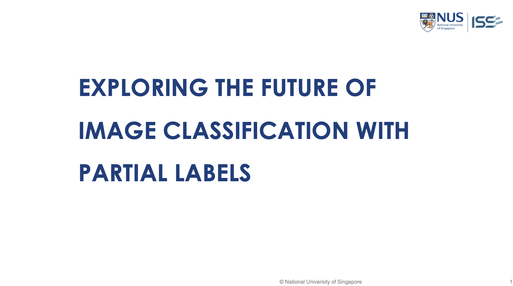

## SECTION 1 : PROJECT TITLE
## RABLE - Rebalancing Data with Generative Method for Imbalanced Partial Label Learning

---

## SECTION 2 : EXECUTIVE SUMMARY / PAPER ABSTRACT
Singapore ranks amongst countries with the highest population density in the world. In a bid to have firm control over long term urban planning, the Singapore government came up with the “Built to Order” (abbreviated BTO) initiative back in 2001. These are new Housing Development Board (HDB) flats tightly controlled by their eligibility and quantity released every year. In more recent years, the modern BTO scheme in Singapore requires a waiting period of 3-4 years, and is generally targeted at young Singaporean couples looking to purchase their first property and set up a family. Nationality and income ceilings are some of the broad filters that determine one’s eligibility for the highly sought after projects. 


Our team, comprising of 6 young Singaporeans, all hope to be property owners one day. Many of our peers opt for BTO flats due to their affordability, existence of financial aid from the government, as well as their resale value. However, there often exists a knowledge gap for these young couples during the decision making process and they end up making potentially regretful decisions. We would like to bridge this knowledge gap, and have hence chosen to base our project on creating a recommender system for BTO flats, utilizing the data from recent launches in Tampines, Eunos, Sengkang and Punggol. 


Using the techniques imparted to us in lectures, our group first set out to build a sizeable knowledge base via conducting an interview and administering a survey. While building the system, we utilized tools such as Java to scrape real time data from HDB website and transform it into a database, CLIPS to synthesize the rule based reasoning process, and Python to integrate it into an easy to use UI for the everyday user. To add icing on the cake, we even hosted the system on a website so that the everyday user can access it through the click of a link.


Our team had an amazing time working on this project, and hope to share our insights with everyone. Despite a focus on BTO flats, we would recommend it for everybody interested in understanding property market trends for residence or investment purposes. There truly are a wide array of factors behind the decision to invest in a property, and we only wish there was more time to work on the scope and scale of the project. 

---

## SECTION 3 : CREDITS / PROJECT CONTRIBUTION

| Official Full Name  | Student ID (MTech Applicable)  | Work Items (Who Did What) | Email (Optional) |
| :------------ |:---------------:| ------| :-----|
| He Yuanyang | A0285691N | Reprocudtion of ABLE,implementation of RABLE, implementation of generative pipeline| E1221503@e.nus.edu |
| Zhang Yixiao | A0285937J | Collation and visualization of project results, research on related work in academia| E1221749@u.nus.edu |
| Liu Zhiqian | A0285884H | Front-end Development; Front-end and Back-end Interface Specification; Model collaberation| E1221696@u.nus.edu |
| Fan Hanwei | A0286013L | Back-end Development; Front-end & model collaberation| E1221825@u.nus.edu |

---

## SECTION 4 : VIDEO OF SYSTEM MODELLING & USE CASE DEMO

[](https://youtu.be/x92ZJYSoL0E)


---

## SECTION 5 : USER GUIDE

For training, Please refer to https://github.com/hyy-2000/R-ABLE

`Refer to appendix <Installation & User Guide> in project report at Github Folder: ProjectReport`

```
> $ conda env create -f environment.yml
```

```
> $ python -m http.server
> $ python app.py
```
> **Go to URL using web browser** http://localhost:8000


## SECTION 6 : PROJECT REPORT

`Refer to project report at Github Folder: ProjectReport`

**Sections of Project Report:**
- Introduction
- The Costly Quest for Precision: A Market Example with Data Analysis
- Related Work
- Methodology
- Visualization
- Conclusions
- References
- Appendix of report: Project Proposal
- Appendix of report: Mapped System Functionalities against modular course
- Appendix of report: Installation and User Guide
- Appendix of report: individual project report per project member
